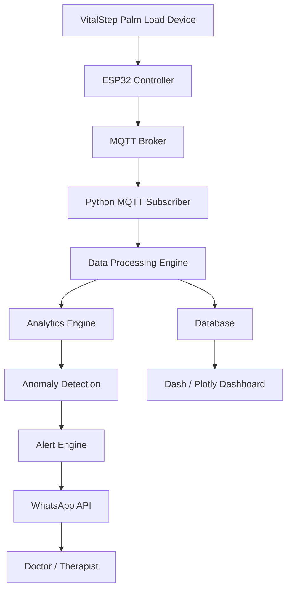

# VitalStep Palm Load Device Analytics via WhatsApp

## Overview
System to stream **palm load (weight) data** from the VitalStep device, analyze palm pressure patterns, detect anomalies, send alerts via WhatsApp, and visualize rehabilitation trends.

The device measures **palm load in kilograms (kg)** using load cells placed under the palm platform.

---

## 1. Device Layer

The VitalStep device measures the **weight applied by the palm** using load cells.

Hardware components:
- Load Cell Sensor
- HX711 Amplifier
- ESP32 Controller
- WiFi / MQTT Communication

### Data Fields

- palm_load_kg
- timestamp
- device_id
- trial_number

Example data packet:

```
{
  "device_id": "VS001",
  "timestamp": "2026-03-12T15:10:20",
  "palm_load_kg": 12.4,
  "trial": 2
}
```

---

## 2. Data Transmission

The ESP32 streams sensor readings using MQTT.

### Topic Structure

```
vitalstep/{device_id}/palm_load
```

Example:

```
vitalstep/VS001/palm_load
```

Architecture:

Device → ESP32 → MQTT Broker

---

## 3. Streaming Service

A Python backend subscribes to MQTT topics.

Responsibilities:

- Receive palm load data
- Validate sensor payload
- Forward to processing pipeline

Technologies:

- Python
- paho-mqtt

Example subscription:

```
vitalstep/+/palm_load
```

---

## 4. Data Processing

After receiving data, the backend performs preprocessing.

### Processing Steps

1. Validate incoming sensor data
2. Remove invalid readings
3. Smooth noisy measurements
4. Compute derived metrics

### Derived Metrics

- peak_load
- average_load
- load_variability
- session_duration

These metrics help analyze **palm weight bearing ability**.

---

## 5. Analytics Engine

The analytics system evaluates the palm load data.

### Rule-Based Analysis

Examples:

- Palm load below expected threshold → Weak palm support
- Rapid fluctuations → Tremor or instability
- Short holding duration → Reduced endurance

Example rule:

```
IF palm_load_kg < 5 kg
→ Weak palm support alert
```

---

### Machine Learning Analysis

Advanced analysis can be done using TensorFlow Lite models.

Possible classifications:

- Normal palm load
- Weak palm support
- Instability during load
- Rehabilitation improvement

Workflow:

Dataset → Model Training → TensorFlow Lite Model → Real-time Inference

---

## 6. Alert Engine

The alert engine combines rule-based and ML outputs.

Example conditions:

- Palm load too low
- Palm unable to sustain weight
- Unstable pressure pattern

Example alert message:

```
VitalStep Alert

Patient ID: 102
Observation: Low Palm Load
Measured Load: 4.2 kg

Recommendation:
Repeat rehabilitation exercise.
```

---

## 7. WhatsApp Notification System

Alerts are delivered using WhatsApp APIs.

Possible platforms:

- Twilio WhatsApp API
- Meta WhatsApp Business API

Message recipients:

- Doctor
- Therapist
- Caregiver

Example notification:

```
VitalStep Device Notification

Patient: Arun
Trial Result:
Palm Load: 11.8 kg

Status: Normal
```

---

## 8. Data Storage

All session data is stored for analysis.

Recommended databases:

- InfluxDB (time-series data)
- PostgreSQL

Stored fields:

- device_id
- timestamp
- palm_load_kg
- peak_load
- average_load
- analysis_result

---

## 9. Dashboard Visualization

Internal analytics dashboard built using **Dash + Plotly**.

### Dashboard Displays

- Palm load vs time
- Trial comparisons
- Patient rehabilitation progress
- Weekly improvement trends

Charts used:

- Line chart (palm load over time)
- Bar chart (trial comparison)
- Trend chart (rehabilitation progress)

---

## System Architecture Diagram



---

## Technology Stack

| Layer | Technology |
|------|-----------|
| Device | Load Cell + HX711 |
| Controller | ESP32 |
| Protocol | MQTT |
| Backend | Python |
| Analytics | TensorFlow Lite |
| Database | InfluxDB / PostgreSQL |
| Dashboard | Dash + Plotly |
| Messaging | WhatsApp API |

---

## Folder Structure

```
vitalstep_project/

 device/
   esp32_firmware

 backend/
   mqtt_listener.py
   data_processor.py
   palm_load_analyzer.py
   anomaly_detector.py

 ml/
   train_model.py
   palm_model.tflite

 notifications/
   whatsapp_sender.py

 dashboard/
   dash_app.py

 database/
   db_handler.py
```

